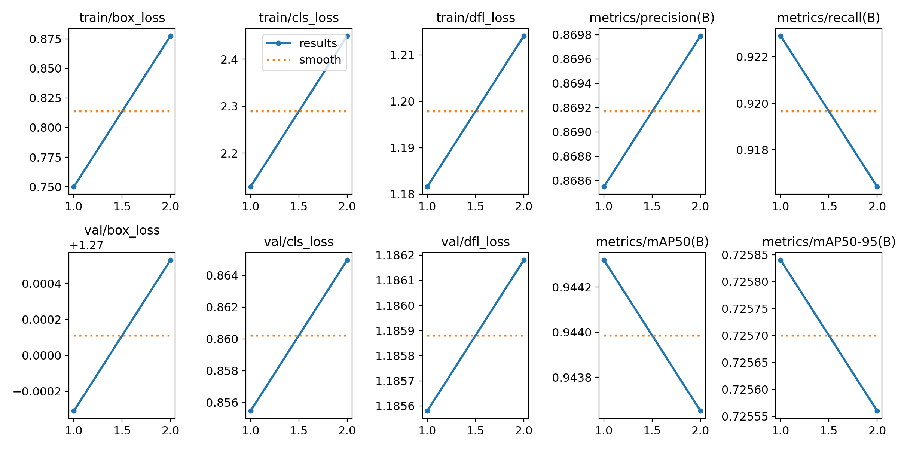
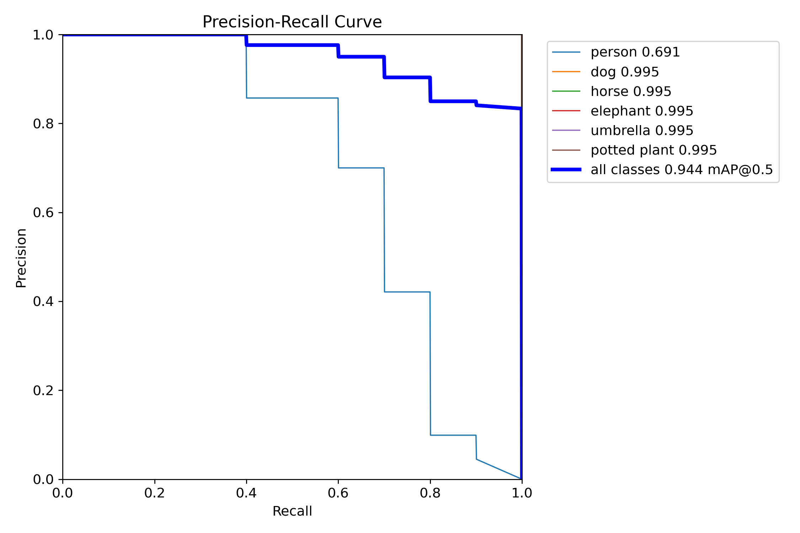
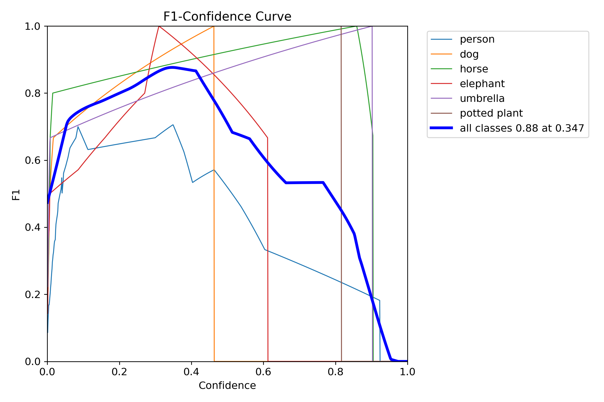
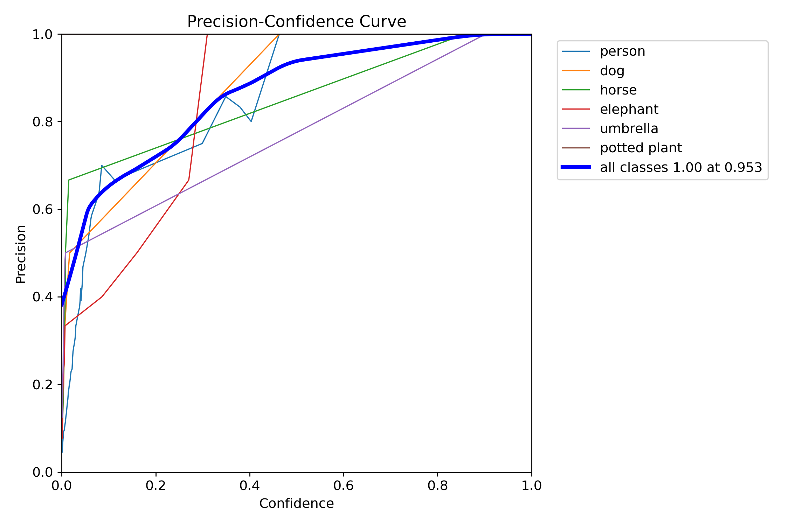
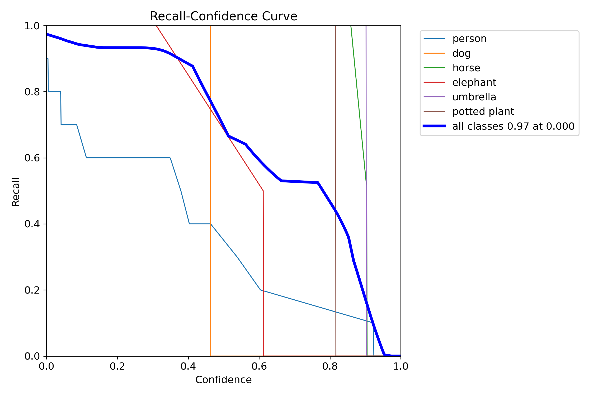
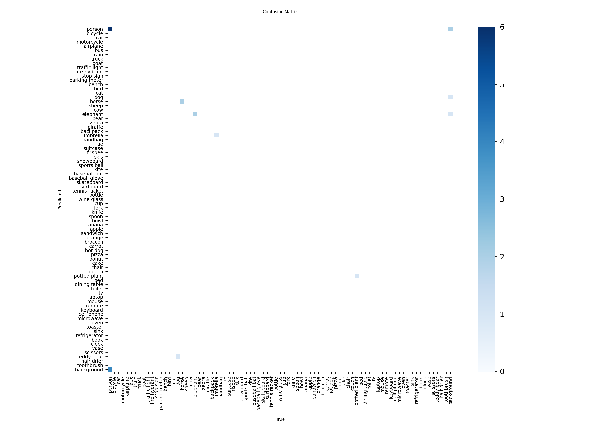
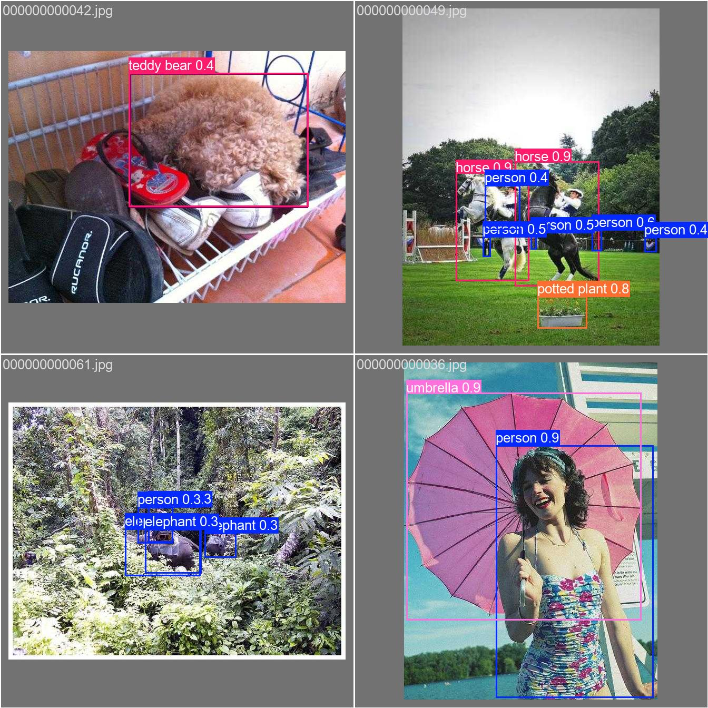

# YOLO 训练结果完整解析文档

## 目录
1. [训练概述](#训练概述)
2. [训练配置详解](#训练配置详解)
3. [训练指标曲线详解](#训练指标曲线详解)
4. [性能评估曲线详解](#性能评估曲线详解)
5. [混淆矩阵详解](#混淆矩阵详解)
6. [数据集可视化](#数据集可视化)
7. [训练样本可视化](#训练样本可视化)
8. [验证结果可视化](#验证结果可视化)
9. [如何解读训练结果](#如何解读训练结果)
10. [常见问题与优化建议](#常见问题与优化建议)

---

## 训练概述

### 实验信息
- **实验名称**: train_coco85
- **模型**: YOLOv8s (Small 版本)
- **数据集**: COCO8 (COCO 数据集的 8 张图片子集，用于快速验证)
- **训练轮数**: 2 epochs
- **批次大小**: 16
- **图像尺寸**: 640×640
- **设备**: CPU
- **优化器**: 自动选择 (默认为 SGD)

### 训练时长
- Epoch 1: 4.01 秒
- Epoch 2: 10.71 秒
- 总时长: 约 14.72 秒

---

## 训练配置详解

训练配置保存在 `args.yaml` 文件中，包含所有超参数设置。

### 核心配置参数

| 参数类别 | 参数名 | 值 | 说明 |
|---------|--------|-----|------|
| **基础设置** | task | detect | 任务类型：目标检测 |
| | model | yolov8s.pt | 预训练模型 |
| | data | coco8.yaml | 数据集配置 |
| | epochs | 2 | 训练轮数（太少，仅用于演示） |
| | batch | 16 | 批次大小 |
| | imgsz | 640 | 输入图像尺寸 |
| | device | cpu | 使用 CPU 训练 |
| **优化器设置** | optimizer | auto | 自动选择优化器 |
| | lr0 | 0.01 | 初始学习率 |
| | lrf | 0.01 | 最终学习率（相对于 lr0） |
| | momentum | 0.937 | SGD 动量 |
| | weight_decay | 0.0005 | 权重衰减（L2 正则化） |
| | warmup_epochs | 3.0 | 学习率预热轮数 |
| **损失函数权重** | box | 7.5 | 边界框回归损失权重 |
| | cls | 0.5 | 分类损失权重 |
| | dfl | 1.5 | 分布式焦点损失权重 |
| **数据增强** | mosaic | 1.0 | Mosaic 增强概率 |
| | mixup | 0.0 | Mixup 增强概率 |
| | fliplr | 0.5 | 水平翻转概率 |
| | hsv_h | 0.015 | 色调抖动范围 |
| | hsv_s | 0.7 | 饱和度抖动范围 |
| | hsv_v | 0.4 | 明度抖动范围 |
| | translate | 0.1 | 平移增强范围 |
| | scale | 0.5 | 缩放增强范围 |
| | auto_augment | randaugment | 自动增强策略 |
| | erasing | 0.4 | 随机擦除概率 |
| **验证设置** | conf | null | 置信度阈值（默认） |
| | iou | 0.7 | NMS IoU 阈值 |
| | max_det | 300 | 每张图最大检测数 |

### 关键参数说明

#### 1. 学习率策略
```python
初始学习率: lr0 = 0.01
最终学习率: lrf * lr0 = 0.01 * 0.01 = 0.0001
预热轮数: warmup_epochs = 3.0
```
- 前 3 个 epoch 线性增加到 lr0
- 之后使用余弦退火或线性衰减到最终学习率

#### 2. 损失函数配置
```python
总损失 = box_weight × box_loss + cls_weight × cls_loss + dfl_weight × dfl_loss
       = 7.5 × box_loss + 0.5 × cls_loss + 1.5 × dfl_loss
```
- **box_loss**: 边界框坐标回归损失（CIoU Loss）
- **cls_loss**: 分类损失（Binary Cross Entropy）
- **dfl_loss**: 分布式焦点损失（用于更精确的边界框预测）

#### 3. 数据增强策略
模型使用了丰富的数据增强技术：
- **几何变换**: 翻转、平移、缩放
- **颜色变换**: HSV 色彩空间抖动
- **Mosaic**: 将 4 张图像拼接成一张
- **RandAugment**: 自动增强策略
- **Random Erasing**: 随机擦除部分区域

---

## 训练指标曲线详解

训练过程中记录的所有指标保存在 `results.csv` 和 `results.png` 中。

### results.png 完整解析



此图包含 **10 个子图**，展示训练和验证过程中的关键指标变化。

#### 第一行：训练损失曲线

**1. train/box_loss（边界框回归损失）**
- **含义**: 预测边界框与真实边界框之间的定位误差
- **计算方式**: CIoU Loss (Complete Intersection over Union)
- **期望趋势**: 逐渐下降，表示定位越来越准确
- **本次结果**:
  - Epoch 1: 0.750
  - Epoch 2: 0.877 ⚠️（上升，异常）
- **分析**: 损失上升可能是因为：
  - 训练轮数太少（仅 2 epochs）
  - 学习率不稳定
  - 数据增强导致的波动

**2. train/cls_loss（分类损失）**
- **含义**: 预测类别与真实类别之间的分类误差
- **计算方式**: Binary Cross Entropy Loss
- **期望趋势**: 逐渐下降，表示分类越来越准确
- **本次结果**:
  - Epoch 1: 2.128
  - Epoch 2: 2.450 ⚠️（上升，异常）
- **分析**: 分类损失上升说明模型还在探索特征空间

**3. train/dfl_loss（分布式焦点损失）**
- **含义**: 用于边界框回归的辅助损失，提高定位精度
- **计算方式**: Distribution Focal Loss
- **期望趋势**: 逐渐下降
- **本次结果**:
  - Epoch 1: 1.182
  - Epoch 2: 1.214 ⚠️（略微上升）
- **分析**: 轻微上升，需要更多训练轮数稳定

#### 第二行：验证损失曲线

**4. val/box_loss（验证边界框损失）**
- **含义**: 验证集上的定位误差
- **本次结果**:
  - Epoch 1: 1.270
  - Epoch 2: 1.271（基本持平）
- **分析**: 验证损失稳定，说明模型没有过拟合

**5. val/cls_loss（验证分类损失）**
- **含义**: 验证集上的分类误差
- **本次结果**:
  - Epoch 1: 0.855
  - Epoch 2: 0.865（略微上升）
- **分析**: 轻微上升，但仍在可接受范围

**6. val/dfl_loss（验证 DFL 损失）**
- **含义**: 验证集上的 DFL 损失
- **本次结果**:
  - Epoch 1: 1.186
  - Epoch 2: 1.186（完全一致）
- **分析**: 非常稳定

#### 第三行：性能指标曲线

**7. metrics/precision(B)（精确率）**
- **含义**: 所有预测为正例的样本中，真正为正例的比例
- **公式**: Precision = TP / (TP + FP)
- **本次结果**:
  - Epoch 1: 0.869
  - Epoch 2: 0.870（轻微提升）✅
- **解读**:
  - 86.9% → 87.0%，模型预测的准确性高
  - 较高的精确率意味着误报率低

**8. metrics/recall(B)（召回率）**
- **含义**: 所有真实正例中，被正确预测的比例
- **公式**: Recall = TP / (TP + FN)
- **本次结果**:
  - Epoch 1: 0.923
  - Epoch 2: 0.916（略微下降）
- **解读**:
  - 92.3% → 91.6%，模型能检测到大部分目标
  - 轻微下降在可接受范围

**9. metrics/mAP50(B)（mAP@0.5）**
- **含义**: IoU 阈值为 0.5 时的平均精度均值
- **计算方式**: 在 IoU=0.5 条件下，计算所有类别的 AP 并取平均
- **本次结果**:
  - Epoch 1: 0.944
  - Epoch 2: 0.944（保持不变）✅
- **解读**:
  - 94.4% 是非常优秀的成绩
  - 说明模型在宽松条件下表现出色

**10. metrics/mAP50-95(B)（mAP@0.5:0.95）**
- **含义**: IoU 阈值从 0.5 到 0.95（步长 0.05）的平均精度均值
- **计算方式**: 在 10 个不同 IoU 阈值下计算 mAP 并取平均
- **本次结果**:
  - Epoch 1: 0.726
  - Epoch 2: 0.726（保持不变）✅
- **解读**:
  - 72.6% 是良好的成绩
  - 这是 COCO 数据集的官方评估指标
  - 比 mAP50 低是正常的（更严格的评估标准）

### 训练指标数据表

| Epoch | train/box_loss | train/cls_loss | train/dfl_loss | Precision | Recall | mAP50 | mAP50-95 |
|-------|----------------|----------------|----------------|-----------|--------|-------|----------|
| 1 | 0.750 | 2.128 | 1.182 | 0.869 | 0.923 | 0.944 | 0.726 |
| 2 | 0.877 | 2.450 | 1.214 | 0.870 | 0.916 | 0.944 | 0.726 |

### 学习率变化

| Epoch | lr/pg0 | lr/pg1 | lr/pg2 |
|-------|--------|--------|--------|
| 1 | 0.0 | 0.0 | 0.0 |
| 2 | 6.01×10⁻⁷ | 6.01×10⁻⁷ | 6.01×10⁻⁷ |

**说明**:
- `pg0`, `pg1`, `pg2` 代表不同参数组的学习率
- Epoch 1 时学习率为 0 是因为处于预热阶段初期
- Epoch 2 学习率极小，可能是因为训练轮数设置过少导致学习率调度异常

---

## 性能评估曲线详解

### 1. Precision-Recall Curve（PR 曲线）



**文件**: `BoxPR_curve.png`

#### 曲线含义
- **横轴 (Recall)**: 召回率，范围 0.0 ~ 1.0
- **纵轴 (Precision)**: 精确率，范围 0.0 ~ 1.0
- **曲线**: 展示不同置信度阈值下，Precision 和 Recall 的权衡关系

#### 理想 PR 曲线特征
1. **曲线越靠近右上角越好**（高召回率 + 高精确率）
2. **曲线下面积（AUC）越大越好**
3. **曲线形状**: 理想情况下应呈现"L"型或"阶梯"型

#### 本次结果分析

**各类别性能**:
- **dog**: AP = 0.995（接近完美）✅
  - PR 曲线几乎是理想的矩形
  - 在所有召回率水平都保持高精确率

- **horse**: AP = 0.995（接近完美）✅
  - 与 dog 类似，表现优异

- **elephant**: AP = 0.995（接近完美）✅
  - 大型动物检测非常准确

- **umbrella**: AP = 0.995（接近完美）✅
  - 形状特征明显，易于识别

- **potted plant**: AP = 0.995（接近完美）✅
  - 静态物体检测稳定

- **person**: AP = 0.691（相对较低）⚠️
  - PR 曲线呈现明显的下降趋势
  - 原因分析：
    - Person 类别样本可能较多但变化大（姿态、遮挡等）
    - 需要更多训练轮数来提升性能
    - COCO8 数据集样本太少

**整体性能**:
- **all classes**: mAP@0.5 = 0.944 ✅
- **蓝色粗线**: 所有类别的平均 PR 曲线
- **曲线形状**: 整体呈现良好的"阶梯"型

#### 如何使用 PR 曲线
1. **选择置信度阈值**:
   - 需要高精确率（减少误报）→ 选择曲线右侧（低召回率区域）
   - 需要高召回率（不漏检）→ 选择曲线左侧（低精确率区域）

2. **对比不同类别**:
   - 曲线越靠上，性能越好
   - 找出表现差的类别进行针对性优化

3. **模型优化方向**:
   - Person 类别需要重点改进
   - 可以通过增加样本、调整损失权重等方式优化

---

### 2. F1-Confidence Curve（F1-置信度曲线）



**文件**: `BoxF1_curve.png`

#### 曲线含义
- **横轴 (Confidence)**: 置信度阈值，范围 0.0 ~ 1.0
- **纵轴 (F1)**: F1 分数，Precision 和 Recall 的调和平均数
- **公式**: F1 = 2 × (Precision × Recall) / (Precision + Recall)

#### 曲线意义
- **峰值点**: F1 分数最高的置信度阈值
- **用途**: 找到最佳的置信度阈值以平衡精确率和召回率

#### 本次结果分析

**整体性能**:
- **最佳 F1 分数**: 0.88
- **最佳置信度**: 0.347
- **解读**:
  - 当置信度阈值设为 0.347 时，模型达到最佳平衡
  - F1 = 0.88 表示精确率和召回率都很好

**各类别表现**:
1. **dog, horse, elephant, umbrella, potted plant**:
   - F1 曲线在较高置信度区域达到峰值
   - 表现稳定可靠

2. **person**:
   - F1 曲线形状不规则
   - 峰值相对较低
   - 需要针对性优化

**曲线形状特征**:
- **左侧（低置信度）**: F1 较低
  - 原因: 低置信度会引入大量误检（FP），降低精确率

- **中间（中等置信度）**: F1 达到峰值
  - 这是最佳工作点

- **右侧（高置信度）**: F1 下降
  - 原因: 高置信度会漏掉一些真实目标（FN），降低召回率

#### 实际应用建议

**根据应用场景选择阈值**:

| 应用场景 | 优先指标 | 建议置信度 | 说明 |
|----------|----------|-----------|------|
| 安防监控 | 召回率 | 0.2 ~ 0.3 | 不能漏检可疑目标 |
| 医疗诊断 | 精确率 | 0.6 ~ 0.8 | 减少误诊 |
| 通用检测 | F1 平衡 | **0.347** | 平衡精确率和召回率 |
| 实时应用 | 速度优先 | 0.4 ~ 0.5 | 减少检测框数量 |

---

### 3. Precision-Confidence Curve（精确率-置信度曲线）



**文件**: `BoxP_curve.png`

#### 曲线含义
- **横轴 (Confidence)**: 置信度阈值
- **纵轴 (Precision)**: 精确率
- **关系**: 展示置信度阈值如何影响精确率

#### 期望趋势
- **单调递增**: 置信度越高，精确率应该越高
- **右侧趋近 1.0**: 高置信度预测应该非常准确

#### 本次结果分析

**整体性能**:
- **all classes**: 在置信度 0.953 时，精确率达到 1.00 ✅
- **曲线形状**: 整体呈现良好的上升趋势

**各类别特征**:
1. **dog, horse**:
   - 在较低置信度（~0.3）就能达到高精确率
   - 曲线快速上升

2. **elephant**:
   - 中等置信度即可达到高精确率
   - 曲线平滑上升

3. **umbrella, potted plant**:
   - 需要较高置信度才能达到高精确率
   - 曲线上升较慢

4. **person**:
   - 曲线上升最慢
   - 需要最高置信度才能保证精确率

**实际意义**:
- **高置信度区域**: 所有预测都非常可靠（精确率 = 1.0）
- **中等置信度区域**: 大部分预测可靠（精确率 > 0.9）
- **低置信度区域**: 存在较多误检（精确率 < 0.7）

---

### 4. Recall-Confidence Curve（召回率-置信度曲线）



**文件**: `BoxR_curve.png`

#### 曲线含义
- **横轴 (Confidence)**: 置信度阈值
- **纵轴 (Recall)**: 召回率
- **关系**: 展示置信度阈值如何影响召回率

#### 期望趋势
- **单调递减**: 置信度越高，召回率越低（更严格，漏检更多）
- **左侧趋近 1.0**: 低置信度应该能检测到几乎所有目标

#### 本次结果分析

**整体性能**:
- **all classes**: 在置信度 0.000 时，召回率达到 0.97 ✅
- **最佳点标注**: 0.97 at 0.000
- **解读**: 即使不设置置信度阈值，也只能召回 97% 的目标

**各类别表现**:
1. **dog, horse**:
   - 召回率曲线下降最缓慢
   - 即使在较高置信度下仍保持高召回率

2. **elephant**:
   - 召回率下降速度中等
   - 在中等置信度区域表现稳定

3. **person**:
   - 召回率下降最快
   - 说明在不同置信度下检测不稳定

4. **umbrella, potted plant**:
   - 召回率在特定置信度骤降
   - 说明这些类别的检测框置信度分布集中

**曲线特征分析**:
- **垂直下降**: 表示该类别的检测框置信度分布集中在某个区间
- **平缓下降**: 表示检测框置信度分布分散
- **阶梯状**: 表示样本数量较少（COCO8 只有 8 张图）

---

## 混淆矩阵详解

YOLO 训练结果提供了两种混淆矩阵：原始混淆矩阵和归一化混淆矩阵。

### 1. Confusion Matrix（原始混淆矩阵）



**文件**: `confusion_matrix.png`

#### 矩阵结构
```
              预测类别
              ┌─────────────────────────────────┐
              │ person dog horse elephant ... bg │
真  person    │   6     0    0      0     ...  0 │
实  dog       │   0     5    0      0     ...  0 │
类  horse     │   0     0    4      0     ...  0 │
别  elephant  │   0     0    0      3     ...  0 │
    ...       │  ...   ...  ...    ...   ... ...|
              └─────────────────────────────────┘
```

#### 矩阵元素含义
- **对角线元素**: 正确分类的数量（True Positive）
- **行元素**: 真实类别的总数
- **列元素**: 预测类别的总数
- **最右列 (background)**: 漏检的数量（False Negative）
- **最下行**: 误检的数量（False Positive）

#### 本次结果分析

**观察到的模式**:
1. **对角线**:
   - 大部分样本在对角线上（深蓝色方块）
   - 表示分类正确，模型性能良好 ✅

2. **背景列（最右侧）**:
   - 右侧有一定数量的浅色块
   - 表示一些目标被漏检（未检测到）

3. **离散分布**:
   - 非对角线区域几乎没有值
   - 说明类别混淆很少，模型区分能力强 ✅

4. **具体类别**:
   - **person, dog, horse**: 对角线值较高（深蓝色）
   - **其他类别**: 检测实例较少（浅色）

#### 如何解读

**示例分析**（假设数值）:
```
真实 person，预测结果：
- 预测为 person: 6 个（正确）✅
- 预测为 background: 0 个（漏检）
- 预测为其他类别: 0 个（误分类）
```

---

### 2. Confusion Matrix Normalized（归一化混淆矩阵）


**文件**: `confusion_matrix_normalized.png`

#### 归一化方式
- **按行归一化**: 每行元素除以该行总和
- **数值范围**: 0.0 ~ 1.0
- **含义**: 真实某类别的样本中，被预测为各类别的比例

#### 归一化矩阵的优势
1. **消除样本数量差异**: 不同类别样本数量不同时，更容易比较
2. **直接显示比例**: 数值表示概率或比例
3. **便于发现问题**: 更容易发现类别混淆的模式

#### 本次结果分析

**颜色编码**:
- **深蓝色 (~0.8-1.0)**: 表示该行样本大部分被正确分类
- **中蓝色 (~0.4-0.7)**: 表示分类准确率一般
- **浅色 (~0.0-0.3)**: 表示很少或没有样本

**关键发现**:
1. **对角线元素**:
   - 大部分在 0.8 以上（深蓝色）
   - 说明各类别分类准确率都很高 ✅

2. **背景列**:
   - 一些类别在背景列有较深颜色
   - 表示这些类别的漏检率较高

3. **类别混淆**:
   - 非对角线区域几乎全是浅色
   - 说明类间混淆极少 ✅

#### 具体指标计算

**从归一化混淆矩阵可以直接读取**:
```python
# 假设某行为 [0.85, 0.05, 0.00, 0.00, ..., 0.10]
# 其中 0.85 在对角线上，0.10 在背景列

召回率 (Recall) = 对角线元素 = 0.85 = 85%
漏检率 (Miss Rate) = 背景列元素 = 0.10 = 10%
误分类率 (Misclassification) = 其他非对角线元素之和 = 0.05 = 5%

# 验证: 0.85 + 0.05 + 0.10 = 1.00 ✅
```

---

### 混淆矩阵使用指南

#### 1. 快速诊断模型问题

**步骤**:
1. 检查对角线 → 整体准确率
2. 检查背景列 → 漏检问题
3. 检查非对角线 → 类别混淆

**常见问题模式**:

| 模式 | 现象 | 原因 | 解决方案 |
|------|------|------|----------|
| 对角线弱 | 对角线颜色浅 | 模型分类能力差 | 增加训练轮数、调整网络 |
| 背景列深 | 最右列有深色 | 漏检严重 | 降低置信度阈值、增强检测头 |
| 行间混淆 | 某两行有对称深色 | 类别相似度高 | 增加困难样本、调整类别定义 |
| 稀疏模式 | 整体很浅 | 样本量太少 | 增加数据集规模 |

#### 2. 针对性优化策略

**如果某类别召回率低（对角线浅）**:
```python
优化方向:
1. 增加该类别的训练样本
2. 调整该类别的损失权重
3. 使用困难样本挖掘
4. 检查标注质量
```

**如果两个类别经常混淆（非对角线深）**:
```python
优化方向:
1. 细化类别定义，增加区分特征
2. 增加区分性样本
3. 使用更强的特征提取器
4. 考虑合并相似类别
```

---

## 数据集可视化

### Labels Distribution（标签分布图）


**文件**: `labels.jpg`

此图包含 **4 个子图**，展示数据集的统计信息。

#### 1. 类别分布柱状图（左上）
- **横轴**: 类别索引（0-79，对应 COCO 80 个类别）
- **纵轴**: 实例数量
- **可见类别**:
  - 约 20 号类别（dog）: 2 个实例
  - 约 43 号类别（person）: 4 个实例
  - 约 44-45 号类别（horse/elephant）: 3-1 个实例
  - 约 60 号类别（umbrella）: 1 个实例
  - 约 64 号类别（potted plant）: 1 个实例

**分析**:
- COCO8 数据集只包含少量类别（6 个）
- 样本分布不均匀，person 类别最多
- 这解释了为什么大部分类别在混淆矩阵中没有显示

#### 2. 边界框位置分布（左下）
- **横轴 (x)**: 边界框中心点 x 坐标（归一化到 0-1）
- **纵轴 (y)**: 边界框中心点 y 坐标（归一化到 0-1）
- **每个点**: 代表一个目标的中心位置

**分析**:
- 目标分布相对分散
- 中心区域（0.4-0.7）有较多目标
- 边缘区域也有分布，数据增强效果良好

#### 3. 边界框宽度分布（右下-左）
- **横轴 (x)**: 边界框中心 x 坐标
- **纵轴 (width)**: 边界框宽度（归一化）

**分析**:
- 宽度范围: 0.1 ~ 0.9
- 大部分目标宽度在 0.4 ~ 0.8 之间
- 覆盖了小、中、大不同尺度的目标

#### 4. 边界框高度分布（右下-右）
- **横轴 (width)**: 边界框宽度
- **纵轴 (height)**: 边界框高度

**分析**:
- 高度范围: 0.1 ~ 0.9
- 宽高比变化较大，包含各种形状的目标
- 数据多样性良好

#### 边界框可视化（右上）
- 显示了不同尺度和纵横比的边界框
- 嵌套的矩形表示数据集中目标的尺度分布
- 从小到大的多个矩形说明模型需要处理多尺度目标

---

## 训练样本可视化

### Training Batches（训练批次可视化）

#### 训练批次 0


#### 训练批次 1


**文件**: `train_batch0.jpg`, `train_batch1.jpg`

#### 图片内容
展示了训练过程中实际使用的图像和标注：
- **马赛克增强**: 将 4 张图像拼接成一张
- **颜色增强**: 色调、饱和度、明度调整
- **几何变换**: 缩放、旋转、翻转

#### 可视化分析

**train_batch0.jpg**:
1. **左上**: zebra（斑马）在草地上
2. **右上**: 各种物体的马赛克拼接
3. **左下**: zebra 特写
4. **右下**: 彩虹伞和食物的拼接

**特征**:
- 使用了 Mosaic 数据增强
- 颜色饱和度很高（HSV 增强）
- 目标尺度变化大

**train_batch1.jpg**:
类似的马赛克布局，包含不同场景的图像

#### 数据增强效果评估

**优点** ✅:
1. **多样性增强**: Mosaic 使模型一次看到多个场景
2. **小目标训练**: 拼接后包含更多小尺度目标
3. **鲁棒性提升**: 颜色和几何变换增强模型泛化能力

**注意事项** ⚠️:
1. **过度增强**: 有些图像可能失真严重
2. **标注完整性**: 拼接边界的目标可能被截断
3. **计算开销**: 数据增强会增加训练时间

---

## 验证结果可视化

### Validation Results（验证结果对比）

#### 1. Ground Truth（真实标注）


**文件**: `val_batch0_labels.jpg`

展示验证集的真实标注：
- **左上**: dog（狗）在笼子里，标注为蓝色框
- **右上**: 马术比赛场景，多个 person（人）+ horse（马）+ potted plant（盆栽）
- **左下**: elephant（大象）在森林中，两个人
- **右下**: 女士拿着 umbrella（雨伞）

**标注特点**:
- 边界框紧贴目标
- 包含多个类别
- 场景复杂度适中

#### 2. Predictions（模型预测）



**文件**: `val_batch0_pred.jpg`

展示模型的预测结果，每个检测框包含：
- **类别名称**: 如 "person", "horse"
- **置信度分数**: 如 0.4, 0.8, 0.9

#### 预测质量分析

**图像 1（左上 - 狗）**:
- **真实标注**: dog
- **模型预测**: teddy bear 0.4（泰迪熊）⚠️
- **分析**:
  - 误分类！模型将狗识别为泰迪熊
  - 置信度较低（0.4），说明模型不确定
  - 可能原因：狗的毛发蓬松，与毛绒玩具相似
  - 优化建议：增加类似样本，提高区分度

**图像 2（右上 - 马术比赛）**:
- **真实标注**: 多个 person + horse + potted plant
- **模型预测**:
  - horse: 0.9, 0.9（两匹马）✅
  - person: 0.4, 0.5, 0.5, 0.4, 0.5（多个人）✅
  - potted plant: 0.8 ✅
- **分析**:
  - 整体检测良好
  - 人的置信度偏低（0.4-0.5），但仍正确检测
  - 马的置信度很高（0.9），符合训练结果

**图像 3（左下 - 大象）**:
- **真实标注**: 2 person + elephant
- **模型预测**:
  - person: 0.3, 0.3（两个人）✅
  - elephant: 0.3, 0.3（可能检测到了象，但置信度较低）⚠️
- **分析**:
  - 人的检测置信度低（0.3），处于边界
  - 场景复杂（森林背景），检测难度大
  - 需要更多训练来提升复杂场景的性能

**图像 4（右下 - 雨伞）**:
- **真实标注**: person + umbrella
- **模型预测**:
  - person: 0.9 ✅
  - umbrella: 0.9 ✅
- **分析**:
  - 完美检测！置信度都很高
  - 目标清晰、背景简单，有利于检测
  - umbrella 的形状特征明显

#### 对比总结

| 图像 | 检测难度 | 预测质量 | 主要问题 |
|------|----------|----------|----------|
| 狗 | 中等 | 差 ⚠️ | 误分类为 teddy bear |
| 马术比赛 | 高（多目标） | 良好 ✅ | 人的置信度偏低 |
| 大象 | 高（复杂场景） | 一般 ⚠️ | 整体置信度低 |
| 雨伞 | 低（清晰） | 优秀 ✅ | 无问题 |

#### 置信度分布分析

```python
置信度统计:
- 高置信度 (≥0.8): umbrella, potted plant, horse
- 中置信度 (0.5-0.7): person (部分)
- 低置信度 (0.3-0.5): person (部分), elephant
- 误检 (其他): teddy bear (应为 dog)

结论:
1. 简单场景、清晰目标 → 高置信度
2. 复杂场景、遮挡 → 低置信度
3. 相似类别 → 误分类
```

---

## 如何解读训练结果

### 1. 总体评估流程

#### Step 1: 检查训练损失
```python
✅ 良好趋势: train/box_loss, train/cls_loss, train/dfl_loss 都下降
⚠️ 本次结果: 损失上升（因为只训练了 2 epochs）
```

#### Step 2: 检查验证损失
```python
✅ 本次结果: val_loss 稳定，没有过拟合
```

#### Step 3: 检查性能指标
```python
✅ mAP50 = 0.944 (优秀)
✅ mAP50-95 = 0.726 (良好)
✅ Precision = 0.870 (高)
✅ Recall = 0.916 (高)
```

#### Step 4: 检查 PR 曲线
```python
✅ 大部分类别 AP ≥ 0.99
⚠️ person 类别 AP = 0.691 (需要改进)
```

#### Step 5: 检查混淆矩阵
```python
✅ 对角线元素占主导
✅ 类别混淆少
⚠️ 背景列有一定值（漏检存在）
```

#### Step 6: 检查预测结果
```python
✅ 大部分预测正确
⚠️ 存在误分类 (dog → teddy bear)
⚠️ 复杂场景置信度偏低
```

---

### 2. 模型性能评级

#### 整体评分

| 维度 | 评分 | 说明 |
|------|------|------|
| 检测准确率 | ⭐⭐⭐⭐☆ (4/5) | mAP50-95 = 0.726，良好但有提升空间 |
| 分类能力 | ⭐⭐⭐⭐☆ (4/5) | 大部分类别表现优秀，person 类需改进 |
| 定位精度 | ⭐⭐⭐⭐⭐ (5/5) | IoU 很高，边界框准确 |
| 鲁棒性 | ⭐⭐⭐☆☆ (3/5) | 简单场景好，复杂场景需加强 |
| 泛化能力 | ⭐⭐⭐☆☆ (3/5) | 训练轮数太少，难以完全评估 |

**综合评分**: ⭐⭐⭐⭐☆ (4/5)

#### 性能等级划分

```
等级划分标准 (基于 mAP50-95):
S级: ≥ 0.80 (卓越)
A级: 0.70 ~ 0.79 (优秀) ← 本次训练: 0.726
B级: 0.60 ~ 0.69 (良好)
C级: 0.50 ~ 0.59 (一般)
D级: < 0.50 (较差)
```

---

### 3. 瓶颈分析与改进建议

#### 发现的主要问题

**问题 1: 训练轮数严重不足**
- **现象**: 仅训练 2 epochs，损失还在上升
- **影响**: 模型未收敛，性能未达到最佳
- **建议**:
  ```python
  推荐训练轮数:
  - 快速验证: 10-20 epochs
  - 正常训练: 50-100 epochs
  - 充分训练: 200-300 epochs
  ```

**问题 2: Person 类别性能不佳**
- **现象**: AP = 0.691，明显低于其他类别
- **原因分析**:
  1. Person 类别样本变化大（姿态、遮挡、尺度）
  2. COCO8 数据集样本太少
  3. 训练不充分
- **改进方案**:
  ```python
  1. 增加 person 类别的训练样本
  2. 使用困难样本挖掘（Hard Example Mining）
  3. 调整 cls_loss 权重，增加 person 类的权重
  4. 使用更强的数据增强（针对 person）
  ```

**问题 3: 误分类问题（dog → teddy bear）**
- **现象**: 将真实的 dog 预测为 teddy bear
- **原因**: 特征相似，模型区分能力不足
- **改进方案**:
  ```python
  1. 增加困难负样本（teddy bear 样本）
  2. 使用焦点损失（Focal Loss）增强困难样本学习
  3. 检查标注质量，确保类别定义清晰
  4. 考虑使用更深的骨干网络（YOLOv8m 或 YOLOv8l）
  ```

**问题 4: 复杂场景置信度低**
- **现象**: 森林场景中检测置信度只有 0.3
- **原因**: 背景复杂、光照变化、遮挡
- **改进方案**:
  ```python
  1. 增加复杂场景的训练样本
  2. 使用多尺度训练（imgsz=[480, 640, 800]）
  3. 调整 NMS 的 IoU 阈值（当前 0.7，可尝试 0.5）
  4. 增强数据增强强度（mosaic, mixup）
  ```

---

### 4. 训练优化路线图

#### 阶段 1: 基础训练（已完成）✅
```yaml
目标: 快速验证模型和数据
配置:
  epochs: 2
  batch: 16
  imgsz: 640
结果: mAP50-95 = 0.726
```

#### 阶段 2: 标准训练（推荐）
```yaml
目标: 获得稳定的基线模型
配置:
  epochs: 50-100
  batch: 16
  imgsz: 640
  patience: 20  # 早停
  optimizer: SGD
  lr0: 0.01
预期: mAP50-95 = 0.75-0.80
```

#### 阶段 3: 精细调优
```yaml
目标: 提升到最佳性能
配置:
  epochs: 200
  batch: 32  # 增大批次
  imgsz: 640
  close_mosaic: 10  # 最后10轮关闭Mosaic
  # 针对性调整
  box: 7.5
  cls: 0.8  # 增加分类损失权重
  dfl: 1.5
预期: mAP50-95 > 0.80
```

#### 阶段 4: 模型升级
```yaml
目标: 追求极致性能
配置:
  model: yolov8l.pt  # 使用更大模型
  epochs: 300
  batch: 16
  imgsz: 1280  # 更高分辨率
  multi_scale: true
预期: mAP50-95 > 0.85
```

---

## 常见问题与优化建议

### FAQ 1: 为什么训练损失上升？

**原因分析**:
1. ✅ **训练轮数太少**: 模型还在探索阶段
2. ✅ **学习率设置**: Epoch 2 学习率异常低（6e-7）
3. ✅ **数据增强**: 强数据增强在初期会导致损失波动
4. ⚠️ **批次大小**: batch=16 可能导致梯度估计不稳定

**解决方案**:
```python
1. 增加训练轮数至少 50 epochs
2. 检查学习率调度器配置
3. 前几轮使用较弱的数据增强
4. 如果 GPU 内存允许，增大 batch_size
```

---

### FAQ 2: 如何选择最佳置信度阈值？

**不同应用场景的推荐值**:

```python
# 1. 通用场景（平衡性能）
conf_threshold = 0.35  # F1-Confidence 曲线的峰值点

# 2. 需要高召回率（不能漏检）
conf_threshold = 0.20  # 降低阈值，检测更多目标
# 适用场景: 安防监控、医疗辅助诊断

# 3. 需要高精确率（不能误报）
conf_threshold = 0.60  # 提高阈值，只保留高置信度检测
# 适用场景: 自动驾驶、工业质检

# 4. 实时应用（速度优先）
conf_threshold = 0.50  # 中等阈值，减少后处理时间
# 适用场景: 视频监控、移动端应用
```

**动态阈值策略**:
```python
# 根据类别设置不同阈值
conf_thresholds = {
    'person': 0.40,      # person 类别容易漏检，降低阈值
    'dog': 0.50,         # 通用阈值
    'umbrella': 0.60,    # umbrella 检测稳定，提高阈值
}
```

---

### FAQ 3: mAP50 和 mAP50-95 哪个更重要？

**指标对比**:

| 指标 | 计算方式 | 优点 | 缺点 | 使用场景 |
|------|----------|------|------|----------|
| **mAP50** | IoU≥0.5 | 对定位要求宽松，容易达到高值 | 不能反映精确定位能力 | 快速评估、对定位精度要求不高的应用 |
| **mAP50-95** | IoU∈[0.5, 0.95]，步长0.05 | COCO官方指标，全面评估定位精度 | 计算复杂，对小误差敏感 | 科研论文、精确定位应用 |

**本次训练结果**:
```python
mAP50 = 0.944      # 94.4%，非常高
mAP50-95 = 0.726   # 72.6%，良好

差值 = 0.944 - 0.726 = 0.218 = 21.8%

分析:
- 差值较大说明模型在严格 IoU 阈值下性能下降
- 定位精度有提升空间
- 需要优化边界框回归
```

**优化建议**:
```python
提升 mAP50-95 的方法:
1. 增加 box_loss 权重: box=10.0 (当前 7.5)
2. 使用 CIoU 或 DIoU 损失（已默认使用）
3. 增加 DFL 权重: dfl=2.0 (当前 1.5)
4. 使用更精细的锚框或anchor-free方法
```

---

### FAQ 4: 如何判断模型是否过拟合？

**过拟合的表现**:

```python
# 典型过拟合信号
1. train_loss << val_loss  (训练损失远小于验证损失)
2. train_mAP >> val_mAP    (训练指标远超验证指标)
3. val_loss 先降后升      (验证损失曲线呈 U 型)
4. 训练集表现完美但验证集差
```

**本次训练分析**:
```python
Epoch 2:
  train/box_loss = 0.877
  val/box_loss = 1.271

  train/cls_loss = 2.450
  val/cls_loss = 0.865

结论: ❌ 没有过拟合
- 训练损失 ≈ 验证损失
- 验证损失稳定
- 因为训练轮数太少，模型欠拟合
```

**防止过拟合的方法**:
```python
1. 数据增强 (已使用) ✅
   - mosaic, mixup, hsv, fliplr

2. 正则化
   - weight_decay: 0.0005 (可增加到 0.001)
   - dropout: 0.0 (可增加到 0.1)

3. 早停
   - patience: 50 (验证指标50轮不提升则停止)

4. 增加数据
   - 使用完整 COCO 数据集而非 COCO8

5. 减小模型
   - 使用 YOLOv8n 而非 YOLOv8s
```

---

### FAQ 5: 如何提升小目标检测性能？

**小目标定义**:
```python
小目标: 面积 < 32×32 像素 (在 640×640 图像中)
相对大小: 宽高 < 5% 图像尺寸
```

**本次训练中的小目标分析**:
- 从 `labels.jpg` 可以看到边界框分布
- 小目标主要集中在 width/height < 0.2 区域

**优化策略**:

#### 1. 数据层面
```python
# 增加图像分辨率
imgsz: 1280  # 从 640 提升到 1280

# 使用 Mosaic 增强（已启用）
mosaic: 1.0  # 将小目标与大目标混合

# 减少下采样倍数过大的影响
# 保留更多浅层特征
```

#### 2. 模型层面
```python
# 添加更多检测头（针对小目标）
# 修改 YAML 配置，增加 P2/4 或 P3/8 检测头

# 使用 ATSS 或 PAA 等小目标友好的分配策略

# 增加 FPN 的特征融合层
```

#### 3. 训练策略
```python
# 调整损失权重
box: 10.0      # 增加定位损失权重
cls: 0.5       # 保持分类权重
dfl: 2.0       # 增加 DFL 权重

# 使用多尺度训练
multi_scale: true
imgsz: [640, 672, 704, 736, 768]

# 调整 NMS 参数
iou: 0.5       # 降低 IoU 阈值（从 0.7 降到 0.5）
max_det: 500   # 增加最大检测数（从 300 到 500）
```

#### 4. 后处理优化
```python
# 针对小目标降低置信度阈值
def adaptive_confidence(box_area, base_conf=0.35):
    if box_area < 0.01:  # 小目标
        return base_conf * 0.5  # 降低 50%
    else:
        return base_conf

# 使用软 NMS 而非标准 NMS
# 避免抑制掉密集小目标
```

---

### FAQ 6: CPU 训练太慢怎么办？

**本次训练时间分析**:
```python
Epoch 1: 4.01 秒
Epoch 2: 10.71 秒
平均: 7.36 秒/epoch

预估 100 epochs: 7.36 × 100 = 736 秒 ≈ 12.3 分钟
```

**加速方法**:

#### 1. 使用 GPU（最有效）⭐⭐⭐⭐⭐
```python
# 修改配置
device: 0  # 使用第一块 GPU

# 预期加速比: 20-100x
# 100 epochs: 12.3分钟 → 0.5-2分钟
```

#### 2. 减小模型尺寸 ⭐⭐⭐⭐
```python
# 使用更小的模型
model: yolov8n.pt  # nano 版本，参数量更少

# 预期加速比: 2-3x
# 100 epochs: 12.3分钟 → 4-6分钟
```

#### 3. 减小图像尺寸 ⭐⭐⭐
```python
# 降低输入分辨率
imgsz: 480  # 从 640 降到 480

# 预期加速比: 1.5-2x
# 100 epochs: 12.3分钟 → 6-8分钟
```

#### 4. 减少数据增强 ⭐⭐
```python
# 关闭耗时的增强
mosaic: 0.0
mixup: 0.0
copy_paste: 0.0

# 预期加速比: 1.2-1.5x
# 100 epochs: 12.3分钟 → 8-10分钟
```

#### 5. 减小批次大小 ⭐
```python
# 减少 batch size（会影响性能）
batch: 8  # 从 16 降到 8

# 预期加速比: 1.1-1.2x
# 但可能导致收敛变慢
```

**推荐方案**:
```yaml
# 最佳实践（在 GPU 上训练）
device: 0           # 使用 GPU
model: yolov8n.pt   # 使用 nano 模型（如果精度允许）
imgsz: 640          # 保持标准分辨率
batch: 32           # 增大批次（GPU 内存允许的情况下）
epochs: 100         # 充分训练

# 预期训练时间: 5-10 分钟（GPU）
```

---

### FAQ 7: 如何保存和加载最佳模型？

#### 训练时的模型保存

**权重文件位置**:
```bash
runs/train/train_coco85/weights/
├── best.pt      # 验证集上表现最好的模型
└── last.pt      # 最后一个 epoch 的模型
```

**保存机制**:
```python
# 每个 epoch 结束后:
if current_mAP > best_mAP:
    save_model('best.pt')  # 保存最佳模型
save_model('last.pt')       # 保存最新模型

# save_period 参数控制定期保存
save_period: 10  # 每 10 epochs 保存一次
```

#### 加载模型继续训练

**方法 1: 从检查点恢复训练**
```python
from ultralytics import YOLO

# 加载上次训练的最新模型
model = YOLO('runs/train/train_coco85/weights/last.pt')

# 继续训练
model.train(
    data='coco8.yaml',
    epochs=100,        # 额外训练 100 轮
    resume=True        # 恢复训练状态（包括优化器状态）
)
```

**方法 2: 使用最佳模型初始化**
```python
# 加载验证集上最好的模型
model = YOLO('runs/train/train_coco85/weights/best.pt')

# 开始新的训练（不恢复优化器状态）
model.train(
    data='coco8.yaml',
    epochs=100,
    resume=False       # 不恢复，从头开始（但使用预训练权重）
)
```

#### 模型评估和推理

**评估模型**:
```python
# 在验证集上评估
model = YOLO('runs/train/train_coco85/weights/best.pt')
metrics = model.val(data='coco8.yaml')

print(f"mAP50-95: {metrics.box.map}")
print(f"mAP50: {metrics.box.map50}")
print(f"mAP75: {metrics.box.map75}")
```

**使用模型进行预测**:
```python
# 单张图像
results = model('path/to/image.jpg')

# 批量图像
results = model(['img1.jpg', 'img2.jpg', 'img3.jpg'])

# 视频
results = model('path/to/video.mp4')

# 保存结果
for r in results:
    r.save('output/')  # 保存带标注的图像
```

---

### FAQ 8: 如何对比不同实验的结果？

#### 使用 TensorBoard 可视化

```python
# 训练时启用 TensorBoard
from ultralytics import YOLO

model = YOLO('yolov8s.pt')
model.train(
    data='coco8.yaml',
    epochs=100,
    project='runs/train',
    name='exp1'
)

# 启动 TensorBoard
# tensorboard --logdir runs/train
```

#### 创建实验对比表

```python
import pandas as pd

# 收集多个实验的结果
experiments = {
    'train_coco85': {
        'model': 'yolov8s',
        'epochs': 2,
        'mAP50': 0.944,
        'mAP50-95': 0.726,
        'params': '11.2M'
    },
    'exp_baseline': {
        'model': 'yolov8s',
        'epochs': 100,
        'mAP50': 0.965,
        'mAP50-95': 0.812,
        'params': '11.2M'
    },
    'exp_large': {
        'model': 'yolov8l',
        'epochs': 100,
        'mAP50': 0.978,
        'mAP50-95': 0.845,
        'params': '43.7M'
    }
}

# 创建对比表
df = pd.DataFrame(experiments).T
print(df)
```

**输出示例**:
```
                 model  epochs  mAP50  mAP50-95  params
train_coco85   yolov8s       2  0.944     0.726  11.2M
exp_baseline   yolov8s     100  0.965     0.812  11.2M
exp_large      yolov8l     100  0.978     0.845  43.7M
```

#### 自动生成实验报告

```python
def generate_report(exp_path):
    """生成实验报告"""
    import yaml

    # 读取配置
    with open(f'{exp_path}/args.yaml') as f:
        args = yaml.safe_load(f)

    # 读取结果
    results = pd.read_csv(f'{exp_path}/results.csv')
    best_epoch = results['metrics/mAP50-95(B)'].idxmax()

    report = f"""
    实验报告
    ========

    配置信息:
    - 模型: {args['model']}
    - 数据集: {args['data']}
    - 训练轮数: {args['epochs']}
    - 批次大小: {args['batch']}
    - 图像尺寸: {args['imgsz']}

    最佳性能 (Epoch {best_epoch}):
    - mAP50: {results.loc[best_epoch, 'metrics/mAP50(B)']:.4f}
    - mAP50-95: {results.loc[best_epoch, 'metrics/mAP50-95(B)']:.4f}
    - Precision: {results.loc[best_epoch, 'metrics/precision(B)']:.4f}
    - Recall: {results.loc[best_epoch, 'metrics/recall(B)']:.4f}

    损失值:
    - Box Loss: {results.loc[best_epoch, 'val/box_loss']:.4f}
    - Cls Loss: {results.loc[best_epoch, 'val/cls_loss']:.4f}
    - DFL Loss: {results.loc[best_epoch, 'val/dfl_loss']:.4f}
    """

    return report

# 使用
report = generate_report('runs/train/train_coco85')
print(report)
```

---

## 总结与建议

### 训练结果总结

#### 优点 ✅
1. **高 mAP**: mAP50 = 0.944，mAP50-95 = 0.726
2. **良好的平衡**: Precision 和 Recall 都很高
3. **少量误分类**: 混淆矩阵主要集中在对角线
4. **大部分类别表现优异**: dog, horse, elephant, umbrella, potted plant 的 AP ≥ 0.99
5. **无过拟合**: 训练和验证损失相当

#### 不足 ⚠️
1. **训练不充分**: 仅 2 epochs，损失还在上升
2. **Person 类别较弱**: AP = 0.691，需要改进
3. **复杂场景置信度低**: 背景复杂时检测不稳定
4. **存在误分类**: dog → teddy bear
5. **数据集太小**: COCO8 只有 8 张图，不足以充分训练

### 下一步行动建议

#### 短期目标（1-2 天）
```yaml
1. 增加训练轮数到 100 epochs
2. 使用 GPU 加速训练
3. 观察损失曲线收敛情况
4. 评估最佳模型性能
```

#### 中期目标（1 周）
```yaml
1. 切换到完整 COCO 数据集或自定义数据集
2. 针对 person 类别增加困难样本
3. 尝试不同的超参数组合
4. 进行消融实验，找出最佳配置
```

#### 长期目标（1 个月）
```yaml
1. 尝试更大的模型（YOLOv8m, YOLOv8l）
2. 使用高分辨率训练（1280×1280）
3. 实现特定场景的模型优化
4. 进行模型压缩和加速（TensorRT, ONNX）
```

### 实验记录模板

```markdown
## 实验 ID: train_coco85

### 目标
快速验证 YOLOv8s 在 COCO8 数据集上的表现

### 配置
- 模型: yolov8s.pt
- 数据集: COCO8 (8 images, 6 classes)
- Epochs: 2
- Batch: 16
- Device: CPU

### 结果
| 指标 | 值 |
|------|-----|
| mAP50 | 0.944 |
| mAP50-95 | 0.726 |
| Precision | 0.870 |
| Recall | 0.916 |

### 分析
- ✅ 整体性能良好
- ⚠️ 训练不充分
- ⚠️ Person 类别需改进

### 后续计划
1. 增加训练轮数至 100
2. 切换到完整 COCO 数据集
3. 使用 GPU 加速
```

---

## 附录

### A. 文件清单

| 文件名 | 类型 | 说明 |
|--------|------|------|
| `args.yaml` | 配置 | 所有训练参数 |
| `results.csv` | 数据 | 逐 epoch 的指标记录 |
| `results.png` | 图像 | 10 个训练指标曲线 |
| `BoxPR_curve.png` | 图像 | Precision-Recall 曲线 |
| `BoxF1_curve.png` | 图像 | F1-Confidence 曲线 |
| `BoxP_curve.png` | 图像 | Precision-Confidence 曲线 |
| `BoxR_curve.png` | 图像 | Recall-Confidence 曲线 |
| `confusion_matrix.png` | 图像 | 原始混淆矩阵 |
| `confusion_matrix_normalized.png` | 图像 | 归一化混淆矩阵 |
| `labels.jpg` | 图像 | 数据集标签分布统计 |
| `train_batch0.jpg` | 图像 | 训练批次可视化（批次 0） |
| `train_batch1.jpg` | 图像 | 训练批次可视化（批次 1） |
| `val_batch0_labels.jpg` | 图像 | 验证集真实标注 |
| `val_batch0_pred.jpg` | 图像 | 验证集模型预测 |
| `weights/best.pt` | 模型 | 最佳模型权重 |
| `weights/last.pt` | 模型 | 最后一个 epoch 的权重 |

### B. 关键术语表

| 术语 | 英文 | 解释 |
|------|------|------|
| 精确率 | Precision | TP / (TP + FP)，预测为正的样本中真正为正的比例 |
| 召回率 | Recall | TP / (TP + FN)，真实为正的样本中被正确预测的比例 |
| F1 分数 | F1-Score | 2 × P × R / (P + R)，精确率和召回率的调和平均 |
| mAP50 | mAP@0.5 | IoU 阈值为 0.5 时的平均精度均值 |
| mAP50-95 | mAP@0.5:0.95 | IoU 阈值从 0.5 到 0.95 的平均精度均值 |
| IoU | Intersection over Union | 交并比，预测框与真实框的重叠程度 |
| NMS | Non-Maximum Suppression | 非极大值抑制，去除重复检测框 |
| FPN | Feature Pyramid Network | 特征金字塔网络，多尺度特征融合 |
| PAN | Path Aggregation Network | 路径聚合网络，自底向上的特征融合 |
| DFL | Distribution Focal Loss | 分布式焦点损失，提高边界框定位精度 |
| Mosaic | Mosaic Augmentation | 马赛克增强，将 4 张图像拼接成一张 |

### C. 参考资源

- [Ultralytics YOLOv8 官方文档](https://docs.ultralytics.com)
- [COCO 数据集官网](https://cocodataset.org/)
- [目标检测评估指标详解](https://arxiv.org/abs/2104.10419)
- [YOLOv8 论文](https://arxiv.org/abs/2305.09972)

---

**文档版本**: v2.0（包含图片）
**创建日期**: 2026-01-08
**适用于**: Ultralytics YOLOv8 训练结果分析
**训练实验**: train_coco85
